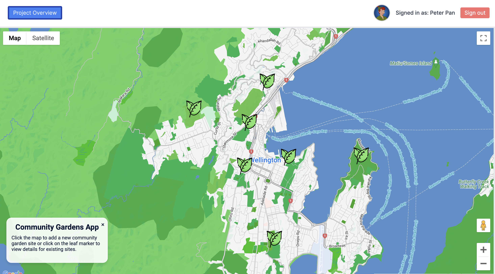
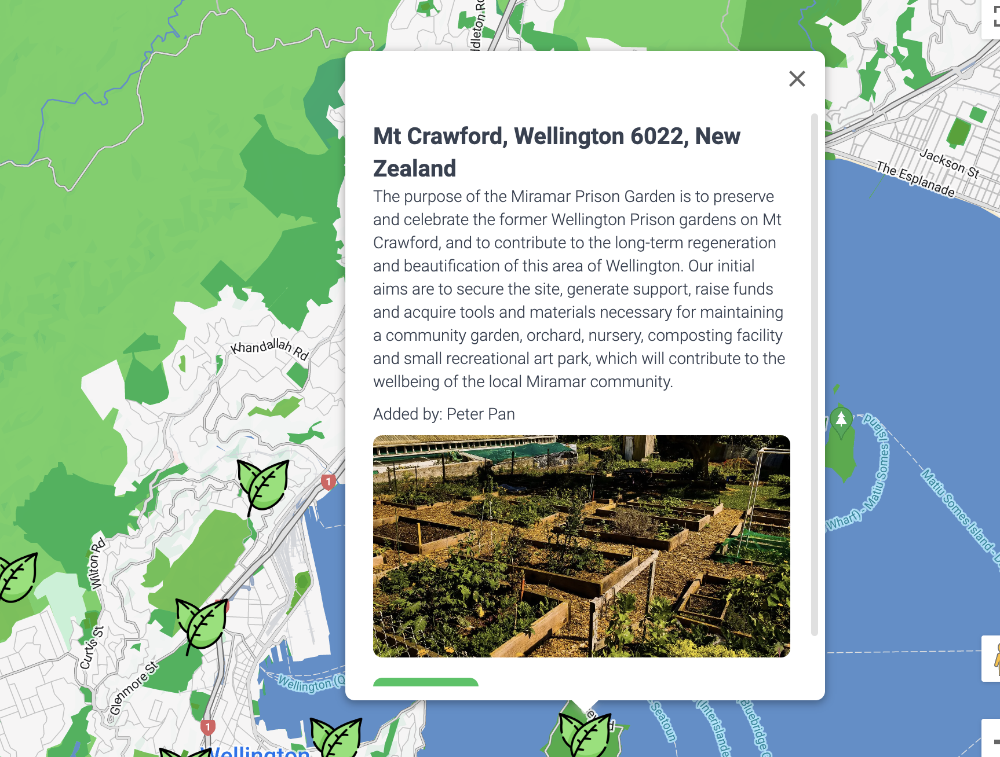
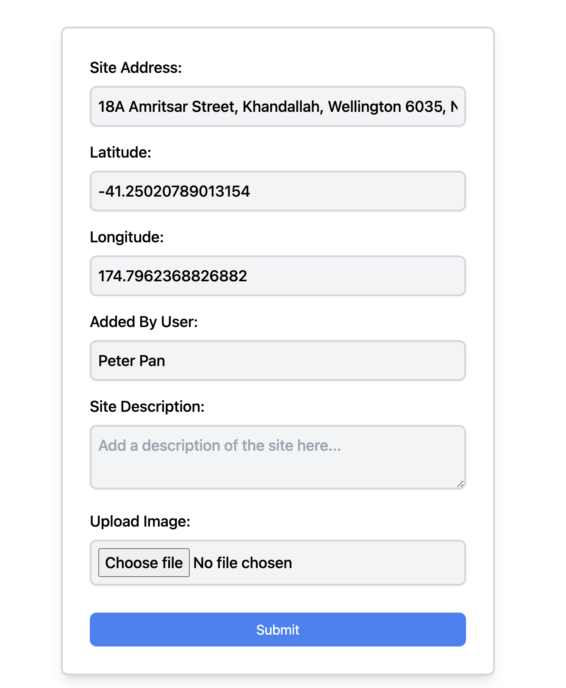

## Project Overview ##

The Community Gardens App helps users locate and add community garden sites. Users can click on the map to add new garden sites or click on existing markers to view details about the gardens. The application integrates with Google Maps for displaying and interacting with map data as well as reverse Geocoding address details from latitude and longitude.

The backend is built with Next.js and Prisma, handling data storage and retrieval. Authentication is managed with NextAuth. The frontend is built with React, styled using Tailwind CSS.

## Technologies Used:
* Next.js
* React
* Prisma
* SQLite3
* NextAuth
* Google Maps API
* Tailwind CSS
* Multer

# Future
Future plans for the Community Gardens App include:
Adding more detailed information and images for each garden site.
Implementing user reviews and ratings for garden sites.
Enhancing the search functionality to filter garden sites based on various criteria.
Integrating social media sharing features to promote community gardens.
##

##

##
